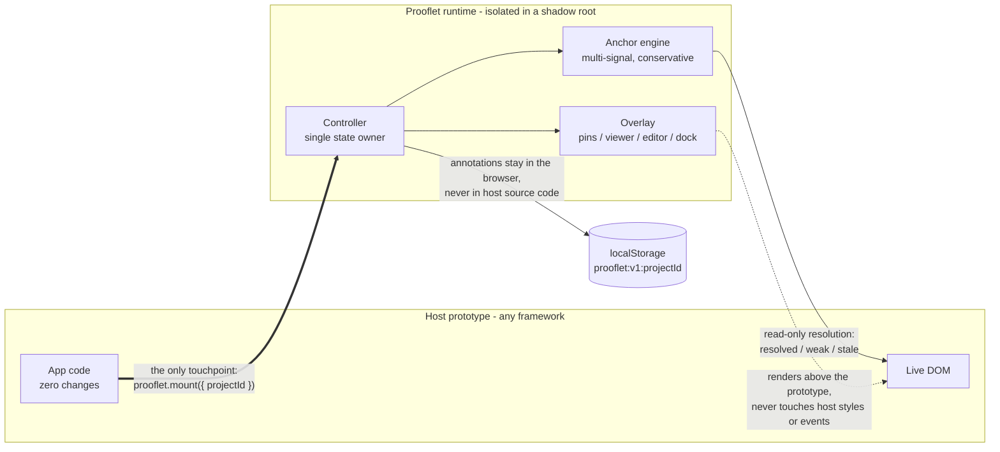
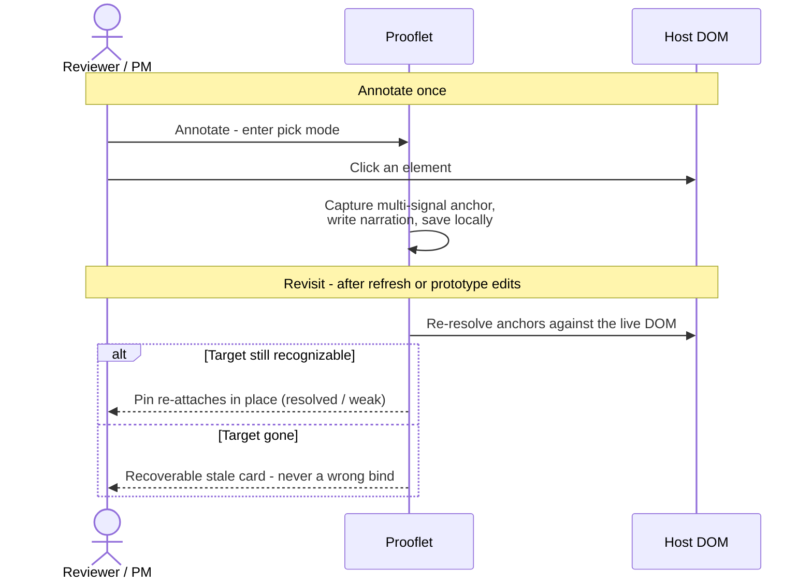

# Prooflet

The proof layer for prototypes.

Prooflet is a lightweight in-page narration and annotation SDK for interactive prototypes. It lets a prototype explain itself without embedding annotation content into the host app's source code.

The first product shape is deliberately small:

- one npm package
- one host import
- in-page element selection
- local annotation storage
- prototype-facing pins, panels, and narration
- no hosted dashboard in V1
- no export in V1
- no backend dependency in V1

## Why

Prototypes fail when intent is trapped outside the interface: in meetings, screenshots, chat threads, or forgotten documents.

Prooflet keeps the explanation beside the thing being explained. A prooflet is a small third-person note anchored to a real UI element, state, or flow. It turns a prototype from a clickable surface into a reviewable argument.

## Install

```bash
pnpm add prooflet
```

```ts
import { prooflet } from "prooflet"

prooflet.mount({
  projectId: "dify-prototype",
})
```

For auto mounting:

```ts
import "prooflet/auto"
```

## How it fits your prototype

Prooflet is a runtime layer, not a framework integration. The host imports
one line; everything else stays on Prooflet's side of the boundary.



- **One import in, one delete out.** No component changes, no framework
  adapters, no build config. Removing the import removes every trace.
- **Hard isolation.** All Prooflet UI lives in a shadow root. The host DOM is
  only read for anchor resolution, never modified or restyled.
- **Conservative anchors.** Annotations survive normal prototype edits as
  `resolved` or `weak`; if the target disappears they degrade to a
  recoverable `stale` card - never a wrong bind.

What a review session looks like:



See [docs/ARCHITECTURE.md](docs/ARCHITECTURE.md) for the runtime internals.

## Principles

1. Runtime first, dashboard later.
2. Annotation content must not live inside host application code.
3. The host app should not need framework-specific integration.
4. Local-first behavior must be useful before cloud sync exists.
5. Anchors must be resilient enough to survive normal prototype edits.
6. The overlay must be visually isolated from the host app.
7. Long-term value comes from portability, review flow, and sync, not from locking up local notes.

## V1 Boundary

Prooflet V1 is a browser-side runtime:

- select an element on the current page
- create or edit a prooflet
- render prooflets over the prototype
- persist data in browser storage for the same project
- detect stale or weak anchors

V1 does not include:

- export/import
- cloud sync
- accounts
- teams
- permissions
- hosted dashboards
- browser extensions
- backend services
- issue tracker integrations

## Development

```bash
pnpm install
pnpm dev
pnpm verify
pnpm pack:check
```

The demo runs at:

```txt
http://127.0.0.1:5173/
```

`pnpm verify` runs typecheck, tests, and package build. `pnpm pack:check` previews the npm package contents before publishing.

See [docs/SPEC.md](docs/SPEC.md) for the product specification,
[docs/ARCHITECTURE.md](docs/ARCHITECTURE.md) for the runtime architecture,
and [docs/MAINTENANCE.md](docs/MAINTENANCE.md) for the change rules.

## License

MIT
