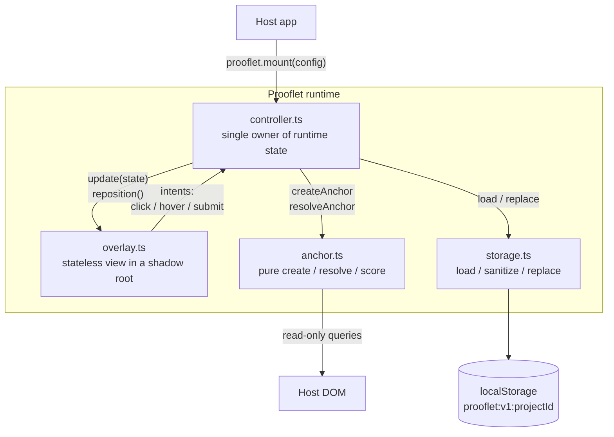
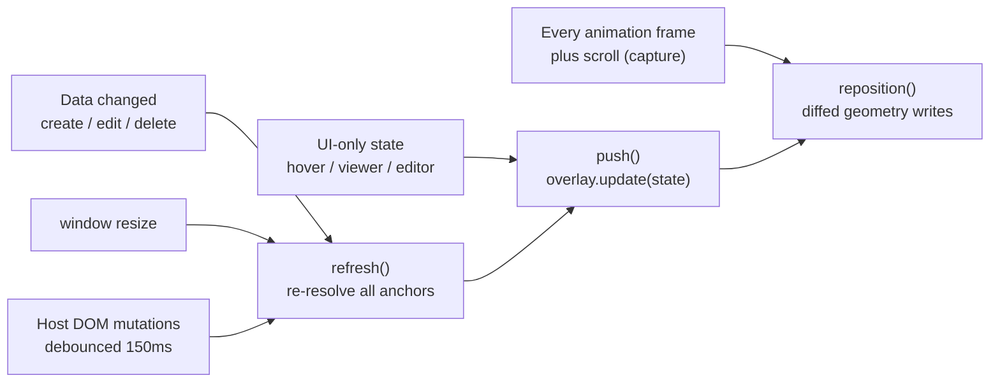
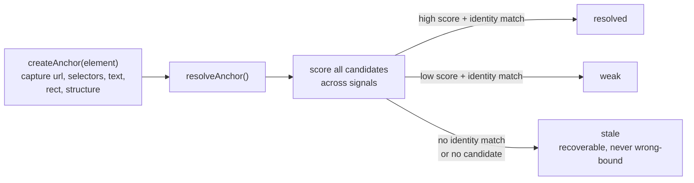

# Prooflet Architecture

Prooflet is a browser-side proof layer: a runtime that lets a live prototype
explain itself in place. This document shows how the runtime is wired. The
rules for changing it safely live in [MAINTENANCE.md](MAINTENANCE.md); the
product boundary lives in [SPEC.md](SPEC.md).

## Module and state flow

Runtime state flows one way. The controller owns all of it; the overlay is a
stateless view that renders the state it is given and reports user intent
back. The anchor module is pure functions; storage is a narrow document
store (and the future cloud-sync seam).

Intents are synchronous callbacks; the controller may re-render inside them.
That is safe because overlay events are delegated on the shadow root and
stateful nodes (the editor) are session-keyed, never rebuilt mid-session.

## Render paths

Layout can change without any catchable event (display-scale switches,
media-query reflows, CSS transitions, font loads). Events therefore drive
anchor re-resolution only; geometry is observed directly every animation
frame and diff-written, so steady frames cost a few rect reads and zero
style writes.

The cost model behind this split: `refresh()` walks the host DOM (expensive,
event-driven and debounced), `push()` re-renders structure from cached
resolutions (cheap, on state change), `reposition()` only reads rects and
writes changed styles (cheapest, every frame).

## Anchor resolution

An anchor stores independent signals captured at selection time: URL, test
ids, ARIA attributes, a CSS path, normalized text, geometry, and a
structural fingerprint. Resolution scores candidates across all signals and
accepts one only if an identity-level signal matches exactly. Weak or stale
is always preferred over a wrong bind.

Stale prooflets stay visible in the dock with edit and delete actions. They
are recoverable state, not garbage.
